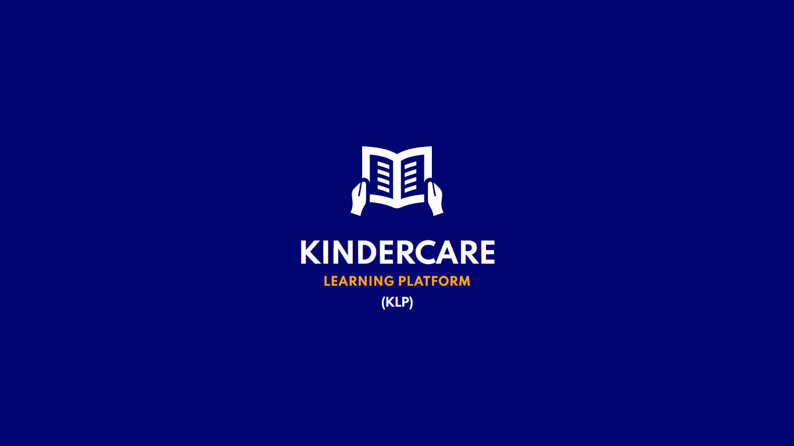
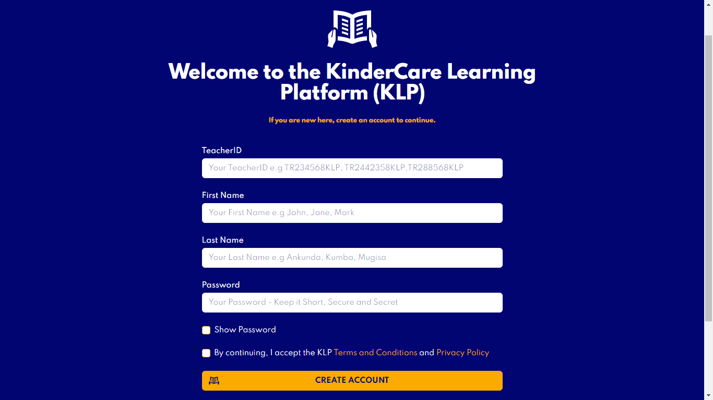
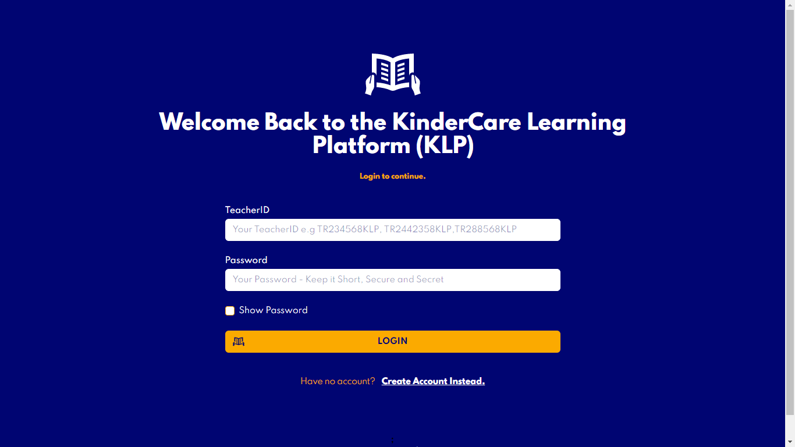
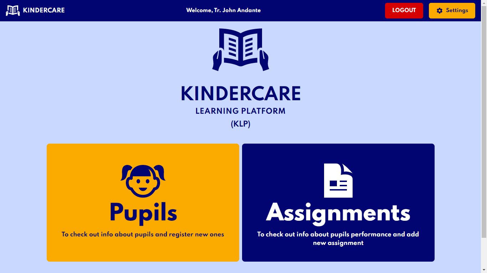
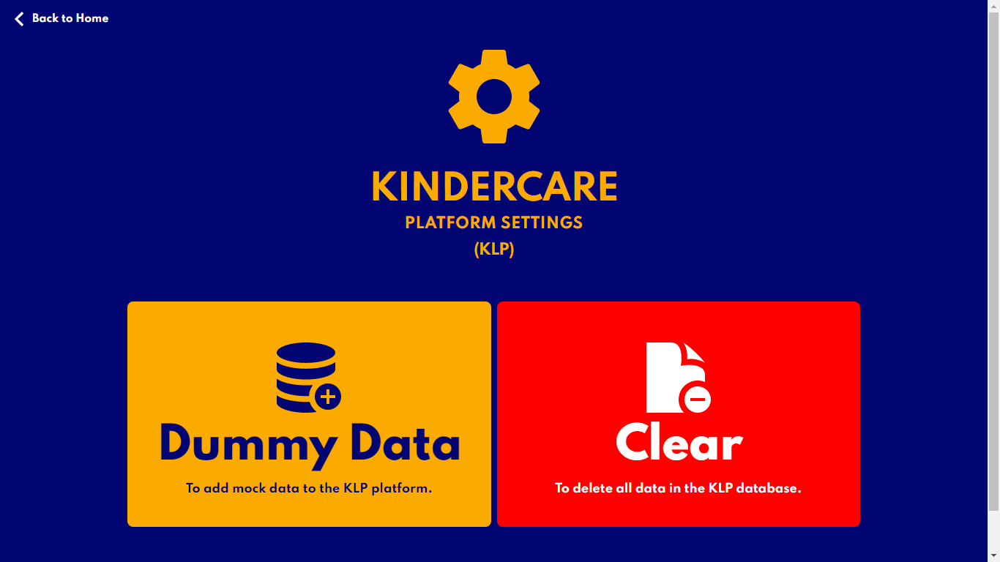
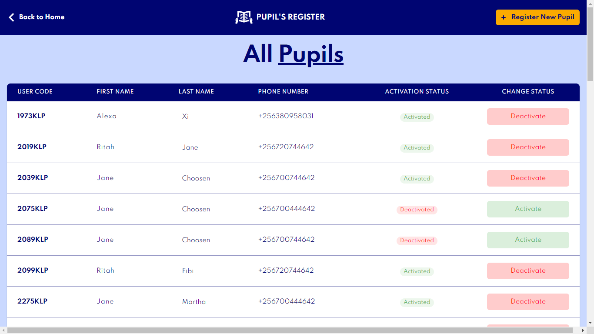
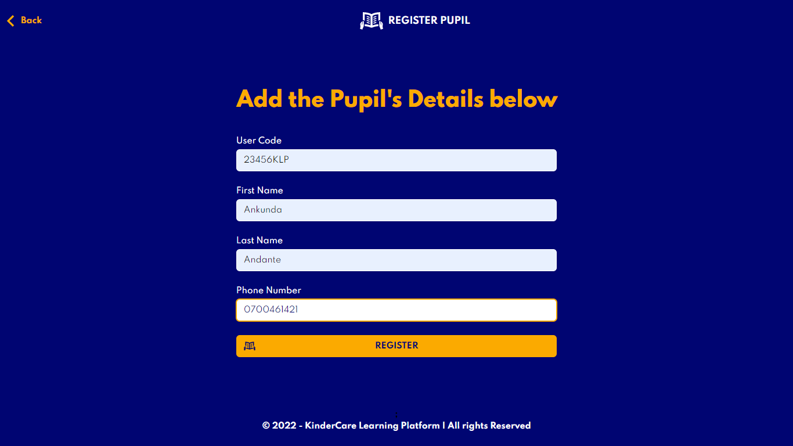
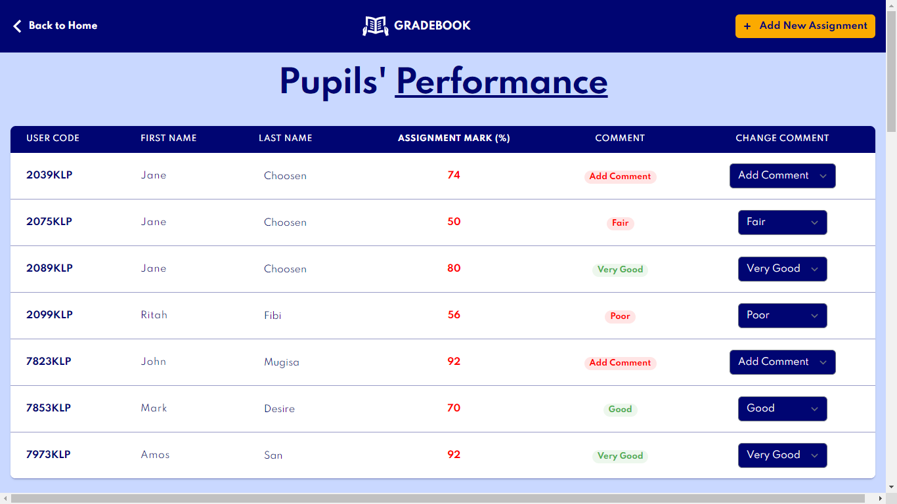
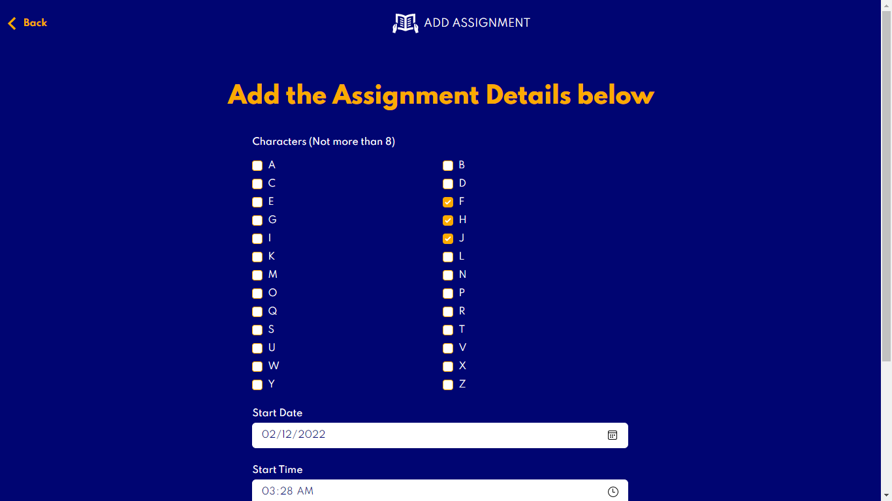

# The KinderCare Learning Platform (KLP).

---

## What is it?

KinderCare Learning Platform is a Web and Command-line based application that is designed to help pupils and teachers at KinderCare.

Pupils use it to draw simple characters on a screen and teachers use it to teach them how to draw characters and even assess them.

## The Members of the Group:

- ANKUNDA ANDANTE RUTAINAMA

- TWAHIRWA EDWARD

- MUGISA BRIAN

- NIWAHEREZA SIMON DESIRE

## Project Structure (Folders)

- ### **/web**

  This contains the Web Interface of the Kindercare Learning Platform (KLP) with code written in _PHP, CSS, HTML, JAVASCRIPT_

  ##### <u>Screenshots</u>

  <!-- Table of title and image on the right -->

  | Screen                | Image                                                        |
  | :-------------------- | :----------------------------------------------------------- |
  | Splash Screen         |                  |
  | Create Account Screen |          |
  | Login Screen          |                    |
  | Home Screen           |                      |
  | Settings Screen       |              |
  | Pupils Screen         |                  |
  | Register Pupil Screen |  |
  | Assignment Screen     |         |
  | Add Assignment Screen |  |

- ### **/cmd**

  This contains the Command-line Interface of the Kindercare Learning Platform (KLP) with code written in _C_

- ### **/db**

  This contains the Database of the Kindercare Learning Platform (KLP) with code written in _SQL, TXT files_. The .txt files are used to connect the Web and Commandline Interfaces.
